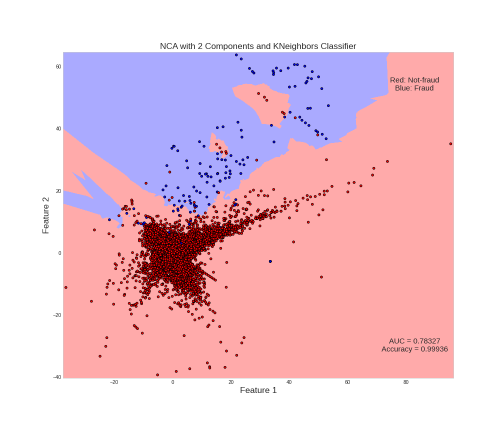

# credit_card_fraud_detection
Application of several machine learning techniques in a [Kaggle's Dataset of credit card fraud](https://www.kaggle.com/mlg-ulb/creditcardfraud "Kaggle's Dataset"). Aplicação de várias técnicas de aprendizado de máquina em um [conjunto de dados do Kaggle](https://www.kaggle.com/mlg-ulb/creditcardfraud "Dados do Kaggle") de fraudes com cartão de crédito.

## Used techniques:

* **Outliers detection and treatment**
* **Data preprocessing with scalers and transformers**
* **Univariate feature selection, Recursive feature elimination, Tree-based feature selection**
* **Dimensionality Reduction with: NCA, PCA and SVD**
* **Under and Oversampling**
* **Grid Search**
* **Binary Classification**

---

*PS: That is **not the best**(although pretty good) AUC that i've got, just the best after reduction to 2 components*
